# Basic EC2 Instance Creation Guide

This repository contains a simplified guide for creating AWS EC2 instances using default settings with step-by-step screenshots.

## Overview

The guide follows a streamlined approach for basic EC2 instance creation, focusing on essential steps with default configurations. Screenshots focus on core concepts that remain stable despite UI changes.

## EC2 Creation Flow Diagram

```mermaid
flowchart TD
    A[Start: AWS Console Login] --> B[Navigate to EC2 Dashboard]
    B --> C[Click Launch Instance]
    C --> D[Choose AMI<br/>📸 Screenshot: ami-selection.png<br/>🔑 Core Concept]
    D --> E[Choose Instance Type<br/>📸 Screenshot: instance-type.png<br/>🔑 Core Concept]
    E --> F[Configure Instance<br/>Use Default Settings<br/>📝 Document settings only]
    F --> G[Add Storage<br/>Use Default Settings<br/>📝 Document settings only]
    G --> H[Configure Security Group<br/>📸 Screenshot: security-group.png<br/>🔑 Critical for Security]
    H --> I[Review and Launch<br/>📝 Document key points only]
    I --> J[Create Key Pair<br/>📸 Screenshot: create-keypair.png<br/>🔑 Essential for SSH]
    J --> K[Download Key Pair<br/>📸 Screenshot: download-keypair.png<br/>🔑 Save for SSH Access]
    K --> L[Instance Running<br/>📸 Screenshot: running-instance.png<br/>🔑 Final State Verification]
    L --> M[Connect to Instance<br/>📝 Document connection methods]
    
    style A fill:#e1f5fe
    style L fill:#c8e6c9
    style M fill:#c8e6c9
    style D fill:#c8e6c9
    style E fill:#c8e6c9
    style H fill:#c8e6c9
    style J fill:#c8e6c9
    style K fill:#c8e6c9
```

## Critical Screenshots (Future-Proof)

### 🔑 Essential Screenshots - ALL COMPLETE! ✅
1. **`ami-selection.png`** ✅ - AMI selection (core concept, rarely changes)
2. **`instance-type.png`** ✅ - Instance type selection (fundamental sizing concept)
3. **`security-group.png`** ✅ - Security group configuration (critical for security)
4. **`create-keypair.png`** ✅ - Key pair creation (essential SSH concept)
5. **`running-instance.png`** ✅ - Final running state (verification step)

### 🎯 Bonus Screenshot:
6. **`download-keypair.png`** ✅ - Key pair download (important for SSH access)

### 📝 Document Instead of Screenshot:
- **Instance Configuration** - List default settings in text
- **Storage Configuration** - Document default EBS settings  
- **Review Screen** - Summarize key points to verify
- **Connection Methods** - List SSH, EC2 Instance Connect options

## Why These Screenshots Matter

| Screenshot | Why It's Future-Proof | Core Learning |
|------------|----------------------|---------------|
| AMI Selection | Fundamental concept of OS selection | Understanding different OS options |
| Instance Type | Core sizing concept (t2.micro, etc.) | Cost and performance implications |
| Security Group | Critical security concept | Network access control |
| Key Pair Creation | Essential for SSH access | Authentication method |
| Key Pair Download | Securing SSH credentials | File management for access |
| Running Instance | Final verification step | Confirming successful deployment |

## Basic Process Flow

1. **AWS Console Login** - Access your AWS account
2. **Navigate to EC2** - Go to EC2 Dashboard  
3. **Launch Instance** - Click "Launch Instance"
4. **Select AMI** - Choose your operating system 🔑 ✅
5. **Choose Instance Type** - Select instance size (t2.micro for free tier) 🔑 ✅
6. **Use Default Settings** - Accept defaults for configuration and storage 📝
7. **Configure Security Group** - Set up basic security rules 🔑 ✅
8. **Review and Launch** - Final review of settings 📝
9. **Key Pair Setup** - Create SSH key pair 🔑 ✅
10. **Download Key Pair** - Save key file securely 🔑 ✅
11. **Verify Running** - Confirm instance is running 🔑 ✅
12. **Connect** - SSH into your running instance 📝

## Prerequisites

- AWS account with EC2 permissions
- Basic understanding of cloud computing
- SSH client for connection

## Important Notes

- **Complete Coverage**: All essential screenshots captured! 🎉
- Focus on core concepts rather than UI details
- Screenshots capture fundamental AWS concepts
- UI may change, but core concepts remain stable
- Always terminate instances when not needed to avoid charges
- Free tier eligible with t2.micro instance type